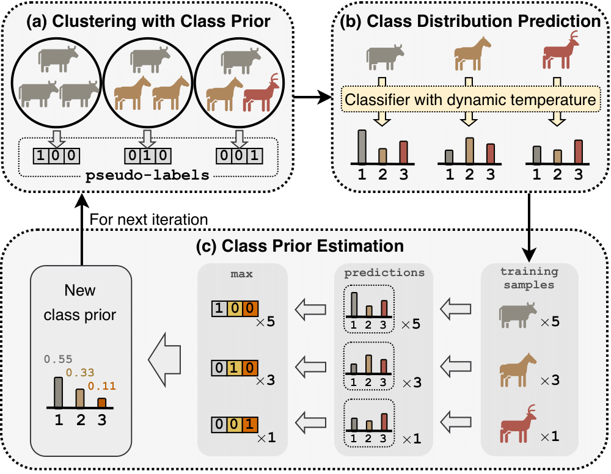

# Bootstrap Your Own Prior (BYOP) for DA-NCD
Code for the CVPR 2023 paper:

> **Title:** Bootstrap Your Own Prior: Towards Distribution-Agnostic Novel Class Discovery<br>
> **Authors:** Muli Yang, Liancheng Wang, Cheng Deng, and Hanwang Zhang<br>
> **Paper:** [CVF Open Access](https://openaccess.thecvf.com/content/CVPR2023/html/Yang_Bootstrap_Your_Own_Prior_Towards_Distribution-Agnostic_Novel_Class_Discovery_CVPR_2023_paper.html)

## Introduction
**Abstract:** Novel Class Discovery (NCD) aims to discover unknown classes without any annotation, by exploiting the transferable knowledge already learned from a base set of known classes. Existing works hold an impractical assumption that the novel class distribution prior is uniform, yet neglect the imbalanced nature of real-world data. In this paper, we relax this assumption by proposing a new challenging task: distribution-agnostic NCD, which allows data drawn from arbitrary unknown class distributions and thus renders existing methods useless or even harmful. We tackle this challenge by proposing a new method, dubbed "Bootstrapping Your Own Prior (BYOP)", which iteratively estimates the class prior based on the model prediction itself. At each iteration, we devise a dynamic temperature technique that better estimates the class prior by encouraging sharper predictions for less-confident samples. Thus, BYOP obtains more accurate pseudo-labels for the novel samples, which are beneficial for the next training iteration. Extensive experiments show that existing methods suffer from imbalanced class distributions, while BYOP outperforms them by clear margins, demonstrating its effectiveness across various distribution scenarios.
<br>
<p align="center">
     <br />
    <em>
    Training pipeline of BYOP for distribution-agnostic NCD
    </em>
</p>


## Setup
- **Environment:** Our implementation is built on [UNO](https://github.com/DonkeyShot21/UNO) v1 and [ComEx](https://github.com/muliyangm/ComEx), so please carefully follow them to prepare the code environment.
- **Datasets:** We use CIFAR10/100 and Tiny-ImageNet datasets in our experiments. The CIFAR datasets can be automatically downloaded to the path specified by `--data_dir` when passing the `--download` argument. For Tiny-ImageNet one can refer to [this script](https://gist.github.com/moskomule/2e6a9a463f50447beca4e64ab4699ac4).
- **Checkpoints:** BYOP follows the two-stage training paradigm (supervised pretraining + novel class discovery). In Distribution-Agnostic NCD, we use the base set (which has the same imbalance ratio as the novel set) to perform the supervised pertraining. We will later release the pretrained checkpoints (as indicated in the TODO list). 
- **Logging:** To use [Wandb](https://wandb.ai/site) for logging, please create an account and specify `--entity YOUR_ENTITY` and `--project YOUR_PROJECT`. Normally, it requires the Internet accessibility to proceed; otherwise, you can pass `--offline` for logging locally, and the generated files can also be manually uploaded to [Wandb](https://wandb.ai/site) for further analysis.

## Commands
Recall that there is a supervised pretraining stage before the discovery phase. If you would like to train your model from scratch, please run the following lines to get a pretrained checkpoint on base classes, where `--true_prior` specifies the preset imbalance ratio. Note that your checkpoint will be located in the `checkpoints` folder by default.
```
CUDA_VISIBLE_DEVICES=0 python main_pretrain.py \
 --dataset CIFAR10 \
 --data_dir PATH/TO/DATASET \
 --gpus 1 \
 --precision 16 \
 --max_epochs 200 \
 --num_labeled_classes 5 \
 --num_unlabeled_classes 5 \
 --true_prior 100 \
 --comment 5_5_p100
```

After that, you can start novel class discovery using the pretrained checkpoint (or directly using the above provided checkpoint) by specifying `--pretrained` with your checkpoint path (and don't forget to set a proper imbalance ratio with `--true_prior`):
```
CUDA_VISIBLE_DEVICES=0 python main_byop.py \
 --dataset CIFAR10 \
 --data_dir PATH/TO/DATASET \
 --gpus 1 \
 --precision 16 \
 --max_epochs 200 \
 --num_labeled_classes 5 \
 --num_unlabeled_classes 5 \
 --true_prior 100 \
 --pretrained PATH/TO/CHECKPOINTS/pretrain-resnet18-CIFAR10_5_5_p100.cp
```

### Tips for running on different datasets
- Specify `--dataset` with `CIFAR10`, `CIFAR100` or `tiny-imagenet`.
- Specify `--data_dir` with the path where you store the dataset.
- Make sure `--num_labeled_classes` and `--num_unlabeled_classes` accord with the setting you want.
- Optionally modify `--comment` so that you can easily find the [Wandb](https://wandb.ai/site) logs.
- Specify `--pretrained` with the path to the checkpoint you would like to use (only for discovery).

## TODO
- [ ] Upload the pretrained checkpoints


## Acknowledgements
Our work is inspired from many recent efforts in various fields:
- [UNO](https://github.com/DonkeyShot21/UNO)
- [SwAV](https://github.com/facebookresearch/swav)
- [SelfLabel](https://github.com/yukimasano/self-label)
- [ORCA](https://github.com/snap-stanford/orca)
- [TRSSL](https://github.com/nayeemrizve/TRSSL)
- [SoLar](https://github.com/hbzju/SoLar)
- [CSA](https://github.com/amzn/confident-sinkhorn-allocation)
- [LogitAdjust](https://github.com/google-research/google-research/tree/master/logit_adjustment)
<!-- - [PAWS](https://github.com/facebookresearch/suncet)
- [CoMatch](https://github.com/salesforce/CoMatch)
- [ACE](https://github.com/jrcai/ACE)
- [TADE](https://github.com/Vanint/TADE-AgnosticLT)
- [MSF](https://github.com/UMBCvision/MSF)
- [NCL](https://github.com/zhunzhong07/NCL)
- [SCAN](https://github.com/wvangansbeke/Unsupervised-Classification) -->


Many thanks for their great work!

## Citations
If you find our work helpful, please consider citing our [paper](https://openaccess.thecvf.com/content/CVPR2023/html/Yang_Bootstrap_Your_Own_Prior_Towards_Distribution-Agnostic_Novel_Class_Discovery_CVPR_2023_paper.html):
```
@inproceedings{yang2023bootstrap,
    title     = {Bootstrap Your Own Prior: Towards Distribution-Agnostic Novel Class Discovery},
    author    = {Yang, Muli and Wang, Liancheng and Deng, Cheng and Zhang, Hanwang},
    booktitle = {Proceedings of the IEEE/CVF Conference on Computer Vision and Pattern Recognition (CVPR)},
    pages     = {3459--3468},
    year      = {2023}
}
```
If you use our code, please also consider citing [ComEx](https://github.com/muliyangm/ComEx): 
```
@InProceedings{yang2022divide,
    title     = {Divide and Conquer: Compositional Experts for Generalized Novel Class Discovery},
    author    = {Yang, Muli and Zhu, Yuehua and Yu, Jiaping and Wu, Aming and Deng, Cheng},
    booktitle = {Proceedings of the IEEE/CVF Conference on Computer Vision and Pattern Recognition (CVPR)},
    pages     = {14268--14277}
    year      = {2022},
}
```
and [UNO](https://github.com/DonkeyShot21/UNO):
```
@InProceedings{fini2021unified,
    title     = {A Unified Objective for Novel Class Discovery},
    author    = {Fini, Enrico and Sangineto, Enver and Lathuili\`ere, St\'ephane and Zhong, Zhun and Nabi, Moin and Ricci, Elisa},
    booktitle = {Proceedings of the IEEE/CVF International Conference on Computer Vision (ICCV)},
    pages     = {9284--9292}
    year      = {2021},
}
```